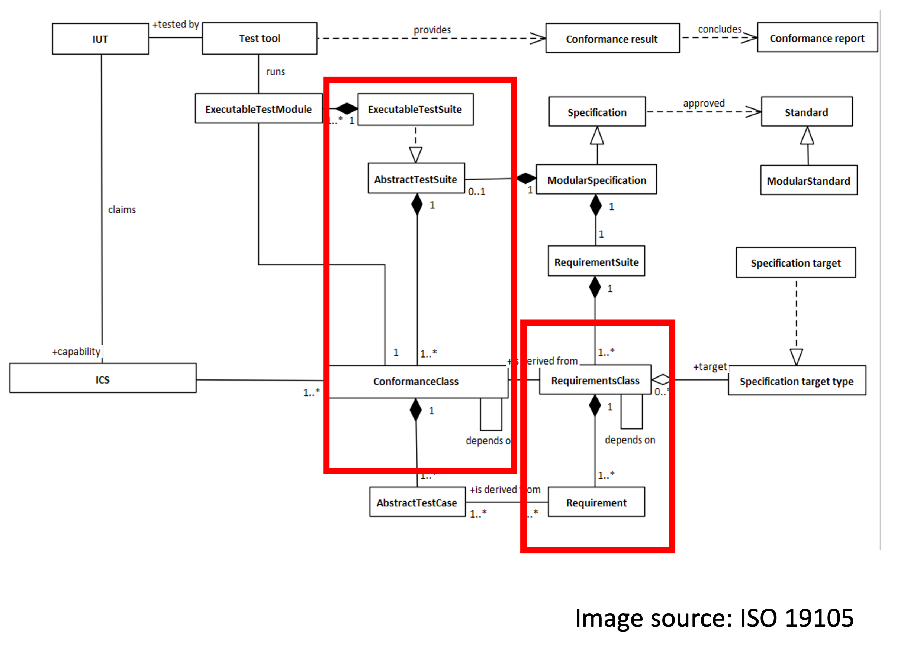

## Testing implementations of OGC API - Features for Compliance to the Standard

This tutorial will walk through the compliance testing process to demonstrate how to check whether a product correctly implements the OGC API - Features standard. Two approaches will be demonstrated: through the hosted TEAM Engine web application, and through the Eclipse IDE (using Maven).

### Introduction

Like other modern OGC Standards, both Parts 1 and 2 of OGC API - Features contain the following normative content:

* **Requirements Class**
  * aggregate of all requirements that have the same specification target to satisfy a conformance test class
* **Requirement**
  * expression in the content of a document conveying criteria to be fulfilled if compliance with the document is to be claimed and from which no deviation is permitted (source: ISO Directives Part 2)
* **Conformance Class**
  * set of abstract test cases that when applied receive a single certificate of conformance
* **Abstract Test Suite (ATS)**
  * set of conformance classes that define tests for all requirements of a specification

The OGC Validator hosts **Executable Test Suites (ETS)** that implement the test methods described in the Abstract Test Suite.

Here is how the specification elements relate to one another.

### Exercise 1: Basics on Validating an Implementation through a hosted Validator

This exercise is for everyone.

Technologies: Web browser

Requirements: Web browser

1. Create an account on the OGC Validator (https://cite.opengeospatial.org/teamengine).
2. Log into the OGC Validator.
3. Select OGC from the list of test providers.
4. Select OGC API - Features from the list of available tests.
5. Create a test session.
6. Enter the address of the landing page.
7. Select the number of collections to parse. The default setting of 3 is fine.
8. Run the test.
9. Review the test results.
10. Submit an application for Compliance Certification.

### Exercise 2: Submitting an application for Compliance Certification

This will be a demonstration only.

1. Navigate to the Certification System https://www.ogc.org/resource/products/registration
2. Create an account, if you do not already have one.
3. Log in, if you already have an account.
4. On the Overview tab, click Add a Product to enter information about your product
5. Click the Compliance tab, then create a new Submission.
6. Select the test results from the appropriate Validator/TEAM Engine instance to attach them to the new Submission.
7. Complete the Trademark Licensing Agreement (TLA), if it is the first application for certification,
8. Submit the application form.
