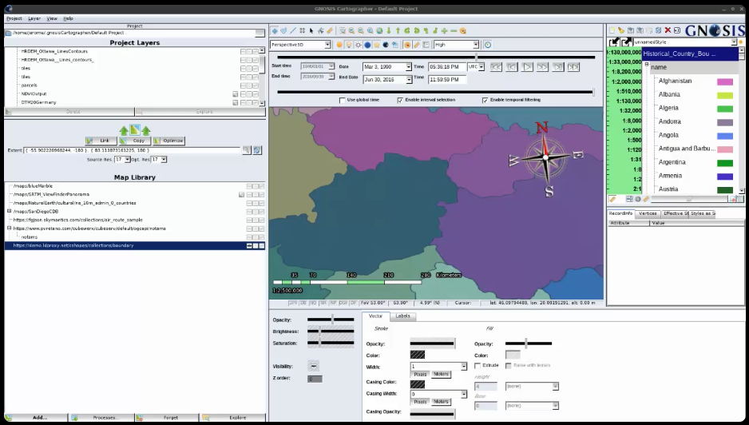
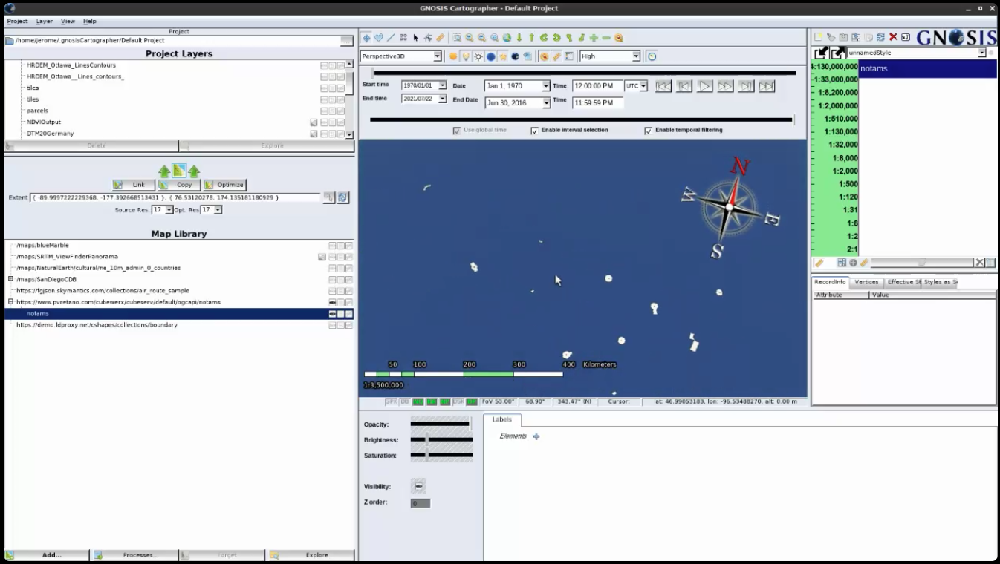
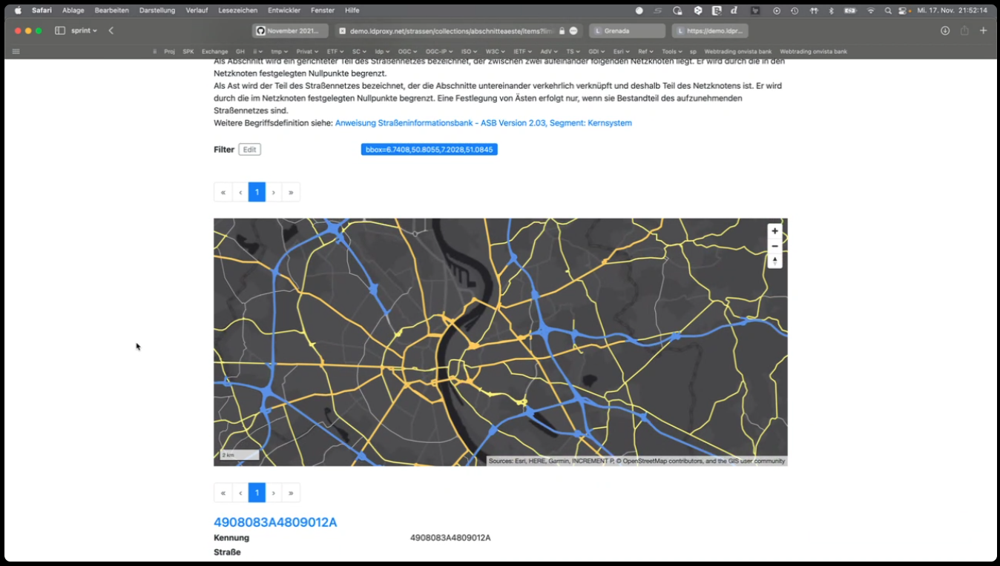
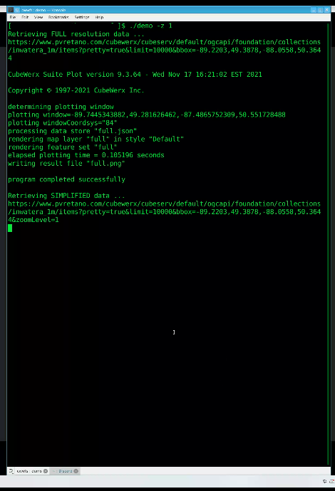

# How it Went! The November 2021 Geospatial API Virtual Code Sprint

From 15th to 17th of November, 2021, the OGC and ISO/TC 211 jointly hosted the November 2021 Geospatial API Virtual Code Sprint. The code sprint focused on the OGC API Features and ISO 19168-1:2020 standards. OGC API - Features offers the capability to serve, create, modify, and query spatial data on the Web and specifies requirements and recommendations for creating APIs that follow a standard way of sharing feature data. ISO 19168-1:2020 Geospatial API for Features is the ISO version of Part 1 of OGC API - Features, which focuses on delivery of feature content.

An OGC Code Sprint is a collaborative and inclusive event driven by innovative and rapid programming with minimal process and organization constraints to support the development of new applications and candidate standards. Over the past three years we have been refining the process for organising and hosting OGC code sprints.

For this November 2021 Geospatial API Virtual Code Sprint, a new approach to Virtual OGC Code Sprints was trialled, by providing video, voice and chat facilities from the same platform - Discord. Also a first for the code sprints, we ran a Mentor Stream in parallel with Breakout rooms for expert developers. The Mentor Streams were designed to help developers get started with OGC API Features and ISO 19168-1:2020 standards.

Day 1 kicked off with Welcome remarks from Dr Joana Simoes (OGC DevRel) and Peter Parslow (ISO/TC 211 Chair-elect). After the welcome remarks, Clemens Portele (interactive instruments) and Panagiotis (Peter) Vretanos (CubeWerx) presented the Goals of the sprint. On Day 1 we also had discussions on [queryables](http://docs.ogc.org/DRAFTS/19-079.html#filter-queryables) and [geometry simplification](https://github.com/opengeospatial/ogcapi-features/issues/654). We also had Mentor Stream sessions on [Sharing data through OGC API - Features](https://github.com/opengeospatial/developer-events/wiki/November-2021-Geospatial-API-Code-Sprint#share-your-data-with-ogc-api-features) led by Dr Joana Simoes (OGC), as well as another session on [Introduction to SpatioTemporal Asset Catalogs (STAC) and its use of OGC API features](https://github.com/opengeospatial/developer-events/wiki/November-2021-Geospatial-API-Code-Sprint#introduction-to-spatiotemporal-asset-catalogs-stac-and-its-use-of-ogc-api-features) led by Chris Holmes (Planet) and Rob Emanuele (Microsoft). In between the discussions and the mentor streams, there was plenty of coding.

On Day 2, we had Mentor Stream sessions on [How to Load feature data into your frontend application](https://github.com/opengeospatial/developer-events/wiki/November-2021-Geospatial-API-Code-Sprint#load-feature-data-into-your-frontend-application) led by Antonio Cerciello (EarthPulse) and [Testing implementations of OGC API - Features for Compliance to the Standard](https://github.com/opengeospatial/developer-events/wiki/November-2021-Geospatial-API-Code-Sprint#testing-implementations-of-ogc-api---features-for-compliance-to-the-standard) led by Dr Gobe Hobona (OGC). There were preliminary demos of geometry simplification through OGC API - Features. Similarly, in between the discussions and the mentor streams, there was plenty more coding.

On Day 3, there was further coding, as well as a **Features and Geometry JSON Lightning Talk** and a final demonstration session. Checkout the screenshots from the final demo below.

## Demonstration Screenshots

### Ecere GNOSIS demonstration screenshots

### interactive instruments ldproxy demonstration screenshots

### CubeWerx cubeserv demonstration screenshots

## Lessons Learnt

There is a need to offer JSON-FG fallback geometry to support different situations i.e. when it should be there and when it should not.

For geometry simplification, the sprint participants started with the `zoom-level`, `scale-denominator` and a number of other parameters and then by the end of the code sprint there was agreement that we should use `zoom-level`.

The sprint participants wanted to support situations in which, based on the zoom level, the server could return a number of features and not some.

A use case for clipping was also demonstrated. For example, if you are looking at New York, you should not need to get the whole of the US coastline.

The sprint participants also made progress on how to handle JSON Schemas.

The sprint participants will file an issue in the JSON-FG repo to look for an extension to mark something with the clipbox (artificial segment). MapML has added the capability. The alternative is always requiring an extra border. That is whether a clipbox should be allowed to go bigger than the data. For example, whether an actual geometry in a shapefile can go beyond the -180 to 180 degrees boundaries.

The code sprint has been good for both JSON-FG and OGC API – Features.

JSON-FG could be considered for a conformance class for OGC API – Features only after JSON-FG has been adopted as an official OGC Standard.

STAC has a number of deployment patterns. One of the patterns exposes an OGC API – Features interface, used for search.

The idea is to have an alignment between STAC and OGC API – Features. This alignment will benefit OGC API – Records too.

Some of the questions are how do we document/describe metadata for the resources offered by OGC API - Features, ISO 19168-1 and their related candidate standards such as STAC and OGC API - Records.

STAC will be a profile of OGC API Records. The STAC community is working on a definition of a Dataset Record for STAC that would be aligned with the Record concept from OGC API Records.

The November 2021 Geospatial API Virtual Code Sprint also demonstrated the Compatibility Mode. Example scenario: If you have a 3D building then you could use JSON-FG, but if you wanted to show a simpler geometry then the server would provide GeoJSON.

## Future Work

The participants made the following recommendations for future work.

**Innovation Program**

*	About delivering MUDDI data using OGC API – Features and JSON-FG
*	Development of a draft specifications for new capabilities being considered for future versions.
*	Implementations of the new capabilities being considered for future extensions: Common Query Language (CQL), CRUD (Create Replace Update Delete), property selection, OpenAPI 3.1, conditional requests, web caching.
*	Security for OGC API Standards Pilot (this could involve the different levels of security e.g. DCS, OpenAPI). This could be a good combination with the CRUD extension.
*	Further code generation tasks in future code sprints.

**Standards Program**

*	Completing CQL
* Further alignment between STAC and OGC API - Records
*	There’s a vote on going in ISO for Part 2. So there may be an opportunity to do some event in the SP once ISO 19168-2 has been approved.

## Conclusions

The code sprint successfully met its objectives. The sprint participants were able to discuss and prototype new capabilities. The sprint participants also found the tutorials and Lightning Talk provided in the Mentor Stream were helpful.

Regarding the new approach for OGC Code Sprints, the sprint participants offered the following recommendations:

* Record the tutorials, so that if a participant misses one they can catch up later
* Arrange a Beginner-to-Expert Mentor Stream that takes a developer all the way through from Getting Started to more Advanced topics. This would require a 3-day programme.
* The Discord idea was really cool!
* In the future we could use the other text channels. Perhaps the first message should explain that “we are going to use this channel in a particular way…”
